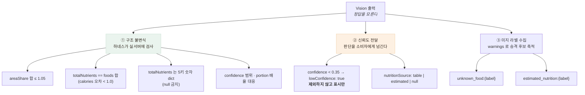

# 식단 분석(Vision) 일관성 측정 — 같은 사진 5회에 5가지 답

> 정답을 만들 수 없는 출력을, 정답 없이 검사하는 방법

## 문제 — 정답을 만들 수가 없다

챗봇과 달리 식단 분석은 **정답 세트를 만들기가 훨씬 어렵다.**

- "이 사진의 비빔밥이 몇 그램인가"를 라벨링하려면 **실제로 저울에 달아야** 한다
- 영양소 정답은 **식약처 DB와 대조**해야 하는데, 그러려면 음식을 정확히 특정해야 한다
- 상차림 사진은 **한식 데이터셋 자체가 부족**하다

그래서 **정확도 대신 다른 것을 검사**했다.

## 무엇을 검사했나 — 구조적 성질과 신뢰도 전달



### ① 구조 불변식 — 정답을 몰라도 검사할 수 있는 것

`totalNutrients == foods 합`은 **정답을 몰라도 반드시 참이어야 하는 성질**이다.
어긋나면 앱 화면에서 바로 티가 난다.

실제로 이 불변식이 설계를 바꿨다. 배율 적용 **전** 원값으로 총합을 계산하면
**반올림 누적 차이**로 어긋난다. 그래서 음식별 값을 먼저 확정(소수 1자리)하고 그 값을 합산한다.

`areaShare 합 ≤ 1.05`도 마찬가지다. 면적 비중의 합이 1을 크게 넘으면
모델이 영역을 중복 계산했다는 뜻이다.

### ② 신뢰도를 어떻게 다루나 — 이게 "신뢰도 표시"의 정체

응답의 두 필드가 신뢰도를 나른다.

| 필드 | 의미 | 왜 이렇게 했나 |
|---|---|---|
| `confidence` + `lowConfidence` | 모델이 이 음식을 얼마나 확신하는가. 0.35 미만이면 `lowConfidence: true` | **낮다고 제외하지 않는다.** 표시만 하고 최종 판단은 앱/백엔드 몫 |
| `nutritionSource` | 영양소가 어디서 왔나 — `table`(검증된 값) / `estimated`(GPT 추정) / `null`(모름) | **값만 주고 출처를 안 주면 앱은 둘을 똑같이 표시하게 된다** |

**낮은 confidence를 서버가 잘라내지 않는 것**이 의도적인 선택이다.

| 후보 | 문제 |
|---|---|
| 임계값 미만은 서버가 제외 | **어르신이 실제로 먹은 음식이 화면에서 사라진다.** 왜 없는지도 알 수 없다 |
| **표시만 하고 넘긴다** | 앱이 판단 로직을 가져야 함 |

두 번째. 이 서버는 무상태 분석기이고 **표시 정책은 소비자 것**이다.
서버가 잘라 버리면 소비자는 그런 음식이 있었다는 사실 자체를 모른다.

### ③ 미지 라벨을 버리지 않고 모은다

테이블에 없는 음식은 `warnings`에 `unknown_food:{label}` / `estimated_nutrition:{label}`로 남는다.
이게 **다음 배포에서 테이블로 승격될 후보**가 된다(트러블슈팅 3).

**실패를 로그로 흘리지 않고 데이터로 만든 것**이다.

## 결과 — 구조 검증

- 계약 하네스가 **실서버에 실사진을 태워** 구조 불변식을 검사 — **34/34**, `--api-key` 시 **37/37**
- `mock` 고정값을 **배율 3분기가 모두 나오도록 설계**(ratio 1.0 / 1.25 / 0.72)
  — 키 없이도 배율 경로 전체가 검증된다
- 성능·비용 측정 — 입력 토큰 37,009 → 3,007, 건당 8.08원 → 0.68원

## 🔴 그래서 일관성을 실제로 재 봤다

챗봇 쪽에서 쓴 기법(메타모픽·지표화)을 **Vision에도 적용**했다.
정답(실제 그램 수)은 못 만들지만, **정답 없이도 잴 수 있는 것**이 있다.

| 재는 것 | 왜 |
|---|---|
| 같은 사진 N회 → 라벨 일치율 | 인식이 흔들리면 그 아래 숫자는 볼 의미가 없다 |
| `totalNutrients` 변동계수(CV) | **화면에 실제로 뜨는 숫자**의 흔들림 |
| `areaShare` 표준편차 | ④ 배율의 입력이라 **portion 판정을 뒤집을 수 있다** |
| 메타모픽 — 재인코딩·리사이즈·좌우반전·밝기 | 의미가 보존되는 변환에도 같은 음식인가 |

**CV(변동계수 = 표준편차/평균)** 를 쓴 이유: 칼로리(수백)와 나트륨(수천)은 스케일이 달라
표준편차를 직접 비교할 수 없다. CV는 무차원이라 항목 간 비교가 된다.

### 사진 두 장을 쓴 이유

| | |
|---|---|
|  |  |
| **돌솥비빔밥** — 단일 음식 | **한정식 상차림** — 반찬 다수 |

> 이미지 출처: Wikimedia Commons —
> [Dolsot-bibimbap.jpg](https://commons.wikimedia.org/wiki/File:Dolsot-bibimbap.jpg) ·
> [Korean_cuisine-Hanjeongsik-03.jpg](https://commons.wikimedia.org/wiki/File:Korean_cuisine-Hanjeongsik-03.jpg)

**처음엔 비빔밥 한 장으로만 쟀는데 CV가 전부 0.0%로 나왔다.** 완벽해 보였지만
검사가 성립하지 않은 것이었다 — `parsing.py`가 `areaShare`를 **합이 1이 되도록 정규화**하므로
음식이 하나면 항상 `1.000`이고 분산이 0이다.

**흔들림은 "몇 개로 쪼갤 것인가"에서 나온다.** 그래서 반찬이 여럿인 상차림을 추가했다.

### 결과 — 같은 사진 5회

| | 돌솥비빔밥 (단일) | 한정식 상차림 (반찬 다수) |
|---|---|---|
| 서로 다른 결과 | **1종** | **5종 (5회 모두 다름)** |
| 최빈 결과 비율 | 100% | **20%** |
| Jaccard 평균 | 100% | **27.0%** |
| 음식 개수 | 1 | 6~7 |

```
5회 결과가 전부 달랐다
  grilled_fish, kimchi, noodle_side_dish, rice,          soup,  vegetable_side_dish
  grilled_fish, kimchi, mixed_vegetables,  noodles,      soup,  tofu_stew
  grilled_fish, kimchi, mixed_vegetables,  pickled_vegetables, rice, seaweed_salad, stews
  grilled_fish, kimchi, pancake,           soup,   steamed_rice, stir-fried_vegetables
  grilled_fish, kimchi, seasoned_vegetables, stew, steamed_rice, sweet_potato_noodle
```

**화면에 뜨는 총 영양소가 이만큼 흔들린다.**

| 항목 | 평균 | 최소 | 최대 | **CV** |
|---|---|---|---|---|
| calories | 913.3 | 822.5 | 1042.0 | **10.6%** |
| carbsG | 102.1 | 54.2 | 136.8 | **29.9%** |
| proteinG | 51.3 | 45.7 | 62.9 | 12.2% |
| fatG | 30.2 | 21.9 | 37.7 | 21.9% |
| **sodiumMg** | 2189.9 | **1452.5** | **2942.5** | **22.2%** |

**나트륨이 1452mg에서 2942mg까지, 2배 차이로 나온다.**
고혈압 어르신에게 나트륨은 핵심 지표인데, **같은 사진을 두 번 찍으면 다른 판정이 나올 수 있다.**

그리고 **portion 판정이 실제로 뒤집혔다.**

```
grilled_fish   area 0.200±0.045   portion  large / regular   ← 뒤집힘
kimchi         area 0.110±0.020   portion  regular / small   ← 뒤집힘
```

배율이 0.65 / 1.0 / 1.35로 갈리므로, 판정이 한 칸 움직이면 **그 음식의 영양소가 2배 차이**난다.

### 결과 — 메타모픽 (의미 보존 변환)

| 변환 | Jaccard | kcal 차이 |
|---|---|---|
| JPEG 재인코딩 (q=75) | **33%** | **+460 (+54%)** |
| 리사이즈 (긴 변 896px) | 50% | +454 (+53%) |
| **좌우 반전** | **15%** | +322 (+38%) |
| 밝기 +15% | 75% | +191 (+22%) |

**좌우로 뒤집었을 뿐인데 Jaccard 15%다.** 음식은 좌우 반전에 의미가 보존되는데,
모델은 거의 다른 상차림으로 본다. 압축 품질만 낮춰도 칼로리가 54% 뛴다.

### 원인 — 라벨 공간이 자유롭다

결과를 보면 흔들림의 정체가 보인다.

```
rice  /  steamed_rice
soup  /  stew  /  stews  /  tofu_stew
vegetable_side_dish  /  seasoned_vegetables  /  stir-fried_vegetables  /  mixed_vegetables
noodles  /  noodle_side_dish  /  stir_fried_noodles  /  sweet_potato_noodle
```

**인식이 틀린 게 아니라 이름과 입도(granularity)가 매번 다르다.**
"밥"을 `rice`로 쓸지 `steamed_rice`로 쓸지, 나물 세 접시를 하나로 묶을지 셋으로 쪼갤지가
호출마다 달라진다.

그리고 그 라벨이 **곧바로 영양 테이블 조회 키**다(트러블슈팅 3).
라벨이 흔들리면 → `table`/`estimated`/`null`이 갈리고 → **총합이 흔들린다.**
라벨 공간 미스매치 문제와 **뿌리가 같다.**

### 부수 발견 — 상차림은 느리다

```
처리 시간  p50 8,665ms · p95 12,681ms
```

비빔밥 한 장은 p50 2.1초인데 **상차림은 8.7초, 최악 12.7초**다.
`detail:low`로 토큰은 고정했지만 **출력이 길어지면(음식 6~7개) 생성 시간이 그만큼 늘어난다.**
어르신이 결과 화면에서 12초를 기다리는 것은 길다.

## 이 측정이 뒤집은 것

**"`detail:low`로 바꿔도 품질이 유지된다"는 주장의 근거가 약했다.**
비빔밥 1장의 confidence 0.9였는데, 그 사진은 애초에 **어떤 설정이든 100% 일관**되는
쉬운 케이스였다. 상차림에서 재야 의미가 있었다.

지금 상태를 정확히 말하면 이렇다.

- `detail:low`가 **상차림 인식을 얼마나 나쁘게 하는지 여전히 모른다.**
  이 측정은 `low` 조건에서만 했다. `high`와 대조하지 않았다
- 다만 **`low`에서 상차림 일관성이 낮다는 것은 확인됐다**

## 챗봇 검증과 비교하면

| | 챗봇(LLM) | 식단 분석(Vision) |
|---|---|---|
| 정답 세트 | 46건 (직접 구축) | **없음** — 저울·식약처 DB가 필요 |
| 정확도 지표 | recall / precision / F1 | **없음** |
| 일관성 | 메타모픽 4케이스 | **메타모픽 4 + 반복 5회 (이번에 추가)** |
| 지연 분포 | p50 974ms · p95 1,757ms | **p50 8,665ms · p95 12,681ms (이번에 추가)** |
| 구조 불변식 | 8케이스 | 하네스 4항목 |

**정확도는 여전히 비어 있다.** 다만 "잴 수 있는 게 없다"에서 **"일관성은 쟀고 정확도가 남았다"** 로
줄었고, 그 과정에서 **정확도보다 먼저 고쳐야 할 문제(라벨 흔들림)** 가 드러났다.

## 남은 한계

- **정확도가 아니라 일관성만 쟀다.** 5번 다 똑같이 틀릴 수도 있다.
  실제 그램 수·식약처 DB 대조는 여전히 없다
- **사진 2장, 각 5회다.** 통계적 신뢰구간을 말할 크기가 아니다
- **`detail` 설정 간 대조가 없다.** `low` vs `high`를 같은 사진으로 재야
  비용-품질 트레이드오프를 숫자로 말할 수 있다
- 라벨 흔들림을 **정규화(동의어 사전·입도 고정)로 줄일 수 있는지** 시도하지 않았다.
  프롬프트에 허용 라벨 목록을 주는 방법이 가장 유력한데 아직 안 해 봤다

## 이 결과로 무엇을 해야 하나

측정이 다음 작업을 정해 줬다.

1. **프롬프트에 라벨 어휘를 고정**한다 — 자유 라벨을 허용 목록으로 좁히면
   동의어 흔들림이 줄고, 테이블 조회 성공률도 함께 오른다
2. **N회 호출 후 다수결**을 검토한다 — 비용이 N배라 트레이드오프가 크다.
   `sodiumMg`처럼 안전에 직결되는 항목만 선택적으로 적용하는 방법도 있다
3. **화면에 불확실성을 표시**한다 — 지금은 단일 숫자를 확정처럼 보여 준다.
   CV 22%짜리 값을 소수점까지 보여 주는 것은 과신을 부른다

## 배운 점

- **정답을 못 만들어도 검사할 수 있는 것이 있다는 것.** 구조 불변식은 정답과 무관하게 참이어야 한다
- **모델이 확신하지 못하는 것을 서버가 숨기면 안 된다는 것.** 신뢰도를 붙여 넘기고
  표시 정책은 소비자가 정한다
- **못 한 검증을 목록으로 적어 두면 그게 다음 작업 계획이 된다는 것**
