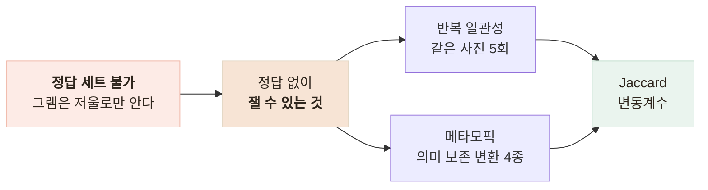

# 같은 사진 5회에 5가지 답 — Vision 일관성을 수치로 재기

> 정답을 만들 수 없는 영역에서 정답 없이 잴 수 있는 것부터 재고, 개선 시도를 두 번 되돌린 기록

<!-- 사진 자리: 같은 한정식 상차림 사진 1장과 5회 분석 결과를 나란히 놓은 비교 캡처 — 라벨 목록과 총 나트륨 값이 매번 다른 상태 -->

## 한눈에

| | |
|---|---|
| **문제** | 분석 품질을 사진 1장의 확신도 0.9로만 말해 왔다 |
| **판단** | 정답 세트를 만들 수 없으니 **정답 없이 잴 수 있는 것**부터 쟀다 |
| **방법** | 반복 5회의 일관성(Jaccard · 변동계수)과 메타모픽 변환 4종 |
| **결과** | 상차림은 5회 모두 다른 답, 나트륨 변동계수 **22.2%** |

## 정답 없이 재는 두 축

- 변환 4종은 JPEG 재인코딩·896px 리사이즈·좌우 반전·밝기 +15%다
- 칼로리와 나트륨은 스케일이 달라 **무차원인 변동계수**로 비교했다

처음에 비빔밥 한 장으로 재니 변동계수가 전부 0.0%였다. 성능이 아니라 **검사가 성립하지 않은 결과**다 — 파서가 면적 비중을 합 1로 정규화하니 음식이 하나면 항상 1.000이다. 그래서 반찬이 여럿인 상차림으로 옮겼다.

## 결과 — 같은 사진 5회

| | 돌솥비빔밥 | 한정식 상차림 |
|---|---|---|
| 서로 다른 결과 | 1종 | **5종 — 5회 모두 다름** |
| 라벨 Jaccard 평균 | 100% | **27.0%** |
| 음식 개수 | 1 | 6~7 |
| 지연 p50 | 2.1초 | **8,665ms** (p95 12,681ms) |

| 항목 | 평균 | 범위 | 변동계수 |
|---|---|---|---|
| 칼로리 | 913.3 | 822.5~1042.0 | 10.6% |
| 탄수화물 | 102.1 | 54.2~136.8 | 29.9% |
| **나트륨** | 2189.9 | 1452.5~2942.5 | **22.2%** |

나트륨은 고혈압 어르신에게 가장 중요한 지표인데 최소와 최대가 2배 차이다. 면적 비중은 1인분 배율(0.65/1.0/1.35)의 입력이라 조금만 흔들려도 판정이 뒤집힌다 — 실제로 뒤집혔다.

## 개선 시도를 두 번 되돌렸다

원인은 인식 오류가 아니라 **동의어**(rice / steamed_rice)와 **입도**(몇 개로 쪼갤 것인가)였다. 모델은 고칠 수 없으니 레버는 프롬프트와 서버 정규화뿐이었다.

| 시도 | Jaccard | 나트륨 CV | 판단 |
|---|---|---|---|
| 개선 전 | 27.0% | 22.2% | — |
| 1차 — 프롬프트로 어휘·묶기 제약 | 76.5% | **35.3%** | 라벨은 안정, 총합은 악화 |
| 2차 — 크기 판정을 서버로, 묶기도 제거 | **50.1%** | 20.9% | 더 나빠져 되돌렸다 |
| 최종 — 어휘는 서버, 묶기는 모델 | 55.9% | 22.7% | 채택 |

크기 판정은 기준이 명확하니 서버가 하고, **묶는 기준은 모델만 알 수 있으니** 프롬프트에 남겼다.

## 그런데 사용자가 보는 숫자는 그대로였다

Jaccard는 27.0%에서 **55.9%(2.1배)**가 됐고 좌우 반전도 15%에서 60%로 올랐다. 그런데 나트륨 변동계수는 **22.2%에서 22.7%**로 거의 안 변했다.

총합 흔들림의 주원인이 동의어가 아니라 **입도**였기 때문이다. 6개로 보든 7개로 보든 어휘는 같을 수 있어 Jaccard는 오르지만 총합은 통째로 달라진다. 개선한 곳과 문제가 있는 곳이 달랐다.

## 남은 한계

| 항목 | 상태 |
|---|---|
| 일관성은 정확도가 아니다 | 5번 다 똑같이 틀릴 수도 있다 |
| 실제 그램 수 | 저울도 식약처 데이터 대조도 없다 |
| 입도 문제 | 못 잡았다 — 화면 숫자는 개선 전과 사실상 같다 |
| 표본 · 어휘 | 5~8회로는 신뢰구간을 못 말하고, 어휘 24종을 혼자 정했다 |

## 배운 점

- 정답을 못 만들어도 **구조 불변식과 일관성**은 잴 수 있다는 것
- 측정 대상을 잘못 고르면 **0이 성능처럼** 보인다는 것
- 지표가 좋아진 것과 문제가 해결된 것은 다르다는 것
