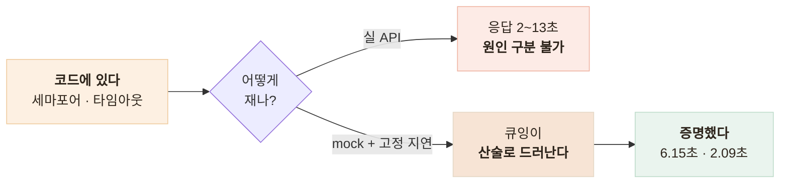

# 코드에만 있던 안전장치를 처음으로 증명 — 부하·동시성 실측

> 서버가 죽는 방식을 먼저 세어 장치를 붙여 두고도 한 번도 확인하지 않았던 것을, 재현 가능한 부하 시나리오로 증명한 기록

## 한눈에

| | |
|---|---|
| **문제** | 서버가 죽는 방식을 막는 장치가 전부 **"코드에 있다"**까지였다 |
| **판단** | 실 API가 아니라 mock에 **고정 지연**을 주입해 결과가 산술로 드러나게 했다 |
| **방법** | 동시 실행 제한 · 전체 타임아웃 · 다운로드 타임아웃 · 이벤트 루프 |
| **결과** | 실 API 0회 · 비용 0원, 헬스체크 폴링 **85회** 대 대조군 **4회** |

## 죽는 방식을 먼저 세고 장치를 짝지었다

기능을 붙이기 전에 추론 서버가 죽는 경로를 네 가지로 나열하고 각각에 장치를 붙였다.

| 죽는 방식 | 붙인 장치 |
|---|---|
| 콜드스타트 — 떠 있지만 일할 수 없다 | 모델은 백그라운드로 로드하고, 그동안 `/health`는 200이지만 `/ready`는 503으로 트래픽을 막는다 |
| GPU 메모리 — 동시 2~3개로 전멸 | 동시 추론을 **세마포어 기본 1**로 제한 — 워커를 늘리면 모델이 배로 로드된다 |
| 루프 블로킹 — 생존 판정 오판 | 동기 추론과 모델 로드를 별도 실행기로 오프로드 |
| 타임아웃 부재 — 무한 점유 | 상한 3계층 (전체 60초 · 이미지 다운로드 10초 · 비전·LLM 호출 30초) |

원칙으로 정리하면 **동시성은 세마포어가, 처리량은 인스턴스 수가** 담당한다. 워커 수는 동시성 손잡이가 아니다.

그런데 넷 다 검증이 없었다. 특히 세 번째는 문서에 *"추론 1건이 도는 동안 헬스체크조차 응답하지 못하면 로드밸런서가 인스턴스를 죽인다"*라고 써 놓고 한 번도 확인하지 않았다. **정확히 적어 뒀으니 안다고 생각한 것이 문제였다.**

## 결정론이 먼저였다

- 지연 1초에 동시 6건이면 동시 실행 1에서 6초, 3에서 2초여야 한다 — **기댓값을 먼저 적고 쟀다**
- 타임아웃도 운영 기본값 60초가 아니라 2초로 낮춰 쟀고, **낮춰서 쟀다는 사실**을 리포트에 남겼다

첫 실행은 전부 422 금지된 이미지 호스트였다. SSRF 방어가 스크립트의 로컬 이미지 서버를 막은 것이고, 측정 실패이면서 **방어가 동작한다는 우연한 증거**였다. 문을 열되 플래그와 허용목록을 둘 다 요구하게 만들었다.

## 시나리오와 결과

| 시나리오 | 조건 | 결과 |
|---|---|---|
| 동시 실행 제한 | 지연 1.0초, 동시 6건, 제한 1 | **6.15초** (기대 약 6초) |
| 동시 실행 제한 | 같은 조건, 제한 3 | **2.09초** (기대 약 2초) |
| 전체 타임아웃 | 지연 4초 > 타임아웃 2초 | **504 at 2.01초** |
| 전체 타임아웃 | 동시 3건, 지연 1.5초, 타임아웃 2초 | `[200, 504, 504]` |
| 다운로드 타임아웃 | 3초 지연 호스트, 타임아웃 1초 | **502 at 1.04초** |

네 번째 줄에서 지연 1.5초는 타임아웃 2초보다 짧은데도 두 건이 504가 됐다 — **대기 시간까지 타임아웃에 포함**된다는 뜻이고 의도한 동작이다. 대기를 빼면 상한이 상한이 아니게 된다.

운영 기본값은 관계식으로 따로 단언했다 — `전체 60초 > 다운로드 10초 + 호출 30초`여야 하위 상한이 의미를 갖는다. 10초 초과는 이미지 호스트가 느리다는 뜻이고 60초 초과는 처리 능력 초과라, 백엔드가 취할 조치가 다르다.

## 대조군이 있어야 값이 근거가 된다

| | 폴링 성공 | p50 | p95 | 최악 |
|---|---|---|---|---|
| 비블로킹 | **85회** | 3ms | 5ms | 17ms |
| 의도적 블로킹(대조군) | **4회** | 1,474ms | 1,549ms | 1,549ms |

비블로킹을 증명하려면 블로킹도 재현해야 하므로 의도적 블로킹을 설정 스위치로 만들었다. 85회·3ms만 있으면 그 숫자가 좋은지 알 수 없다. 헬스체크가 4회밖에 못 돌아오는 것은 **로드밸런서가 인스턴스를 죽이기 시작하는 상태**다.

## 남은 한계

| 항목 | 상태 |
|---|---|
| mock 지연 | 실제 추론의 메모리·GPU 경합은 재현하지 않는다 |
| 대기열 길이 제한 | **없다** — 폭주하면 쌓이다 일괄 실패한다 |
| 운영 기본값 60초 | 낮춰 쟀으므로 별도 단언에만 의존한다 |
| GPU 실기동 부하 | 인스턴스를 못 구해 **미검증**이다 |
| 세마포어 범위 | 프로세스 내 제한 — 확장하면 전체 동시 추론은 인스턴스 수 × 1 |

## 배운 점

- 장애 대응의 시작은 코드가 아니라 **죽는 경로를 먼저 나열하는 것**이라는 것
- **위험을 문서에 정확히 적어 둔 항목**이 가장 오래 미검증으로 남는다는 것
- 부하 측정에서도 결정론이 먼저라는 것
- 좋은 값을 증명하려면 **나쁜 값을 재현**해야 한다는 것
</content>
