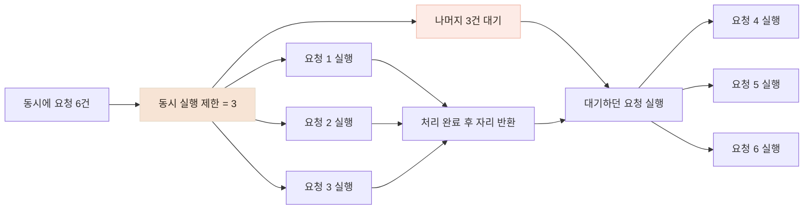

# 식단분석 AI 요청이 몰릴 때를 대비해 동시 실행 제한과 타임아웃을 적용했습니다

> AI 요청이 몰렸을 때 적용한 동시 실행 제한·타임아웃·비차단 처리를 **실제 HTTP 요청으로 검증했습니다.** 먼저 분석 시간만 1초로 고정해 예상값과 비교하고, 이후 **실제 GPT Vision 호출에서도 같은 동시 요청 시나리오를 실행해 운영 여유를 확인했습니다.**

## 한눈에

|              |                                                                                                                            |
| ------------ | -------------------------------------------------------------------------------------------------------------------------- |
| **위험**     | 분석 요청이 한꺼번에 들어오면 서버가 모두 실행하려 하고, 뒤에 밀린 사용자는 오래 기다릴 수 있습니다.                       |
| **적용**     | 동시에 실행할 분석 수와 전체 처리 시간, 이미지 다운로드 시간을 제한했습니다.                                               |
| **1차 검증** | **실제 HTTP 요청에서 분석 시간만 1초로 고정**해 예상 대기 시간·타임아웃·비차단 처리를 확인했습니다.                        |
| **2차 검증** | **실제 GPT Vision을 호출해** 동시 실행 제한별 처리 시간을 측정하고, 이를 바탕으로 **60초 타임아웃의 여유를 계산했습니다.** |

## 요청이 몰려도 예측 가능한 방식으로 처리하도록 했습니다

AI 분석은 일반적인 조회·저장 요청보다 한 건의 처리 시간이 깁니다. 들어온 요청을 전부 동시에 실행하면 서버가 한꺼번에 부하를 받고, 반대로 제한 없이 대기시키면 사용자는 끝나는 시점을 알 수 없습니다.

그래서 설정한 동시 실행 수만 먼저 실행하고 나머지는 대기시키되, 전체 제한 시간을 넘기면 명확하게 종료하도록 구성했습니다. 분석이 진행되는 동안에도 헬스체크 같은 가벼운 요청은 계속 처리할 수 있도록 실행 흐름을 분리했습니다.

이 검증은 최대 처리량을 높이는 실험이 아니라, **요청이 몰렸을 때 서버가 예측 가능한 방식으로 처리하고 실패하는지** 확인하는 데 목적을 뒀습니다.

## 먼저 막아야 할 네 가지 상황을 나눴습니다

| 발생할 수 있는 상황                   | 적용한 방식                                                                              |
| ------------------------------------- | ---------------------------------------------------------------------------------------- |
| 모델이 아직 준비되지 않음             | `/health`와 `/ready`를 나눠 준비 전에는 분석 트래픽을 받지 않습니다.                     |
| 분석 요청이 한꺼번에 실행됨           | 동시에 실행할 수 있는 분석 수를 제한하고, 초과 요청은 실행 가능해질 때까지 대기시킵니다. |
| 오래 걸리는 작업이 다른 요청까지 막음 | 모델 로드와 동기 추론을 별도 실행 흐름에서 처리합니다.                                   |
| 외부 호출이나 대기가 끝나지 않음      | 전체 60초·이미지 다운로드 10초·외부 AI 호출 30초의 상한을 둡니다.                        |

코드에 제한이 존재하는지만 확인하지 않고, **실제 HTTP 요청에서 대기와 종료 시점이 기대한 대로 나타나는지** 측정했습니다.

## 세마포어로 동시에 실행되는 분석 수를 제한했습니다

세마포어는 "동시에 실행할 수 있는 자리"를 정해 두는 방식입니다. 제한이 3이면 자리가 3개 있는 것과 같아서, 6건이 동시에 들어오면 3건만 먼저 실행하고 나머지는 자리가 빌 때까지 대기합니다.



분당 요청 수가 아니라 **현재 동시에 진행 중인 작업 수 자체를 제한**하고 싶었기 때문에 세마포어를 사용했습니다.

## 실제 요청에서 분석 시간만 고정해 제한 장치를 검증했습니다

세마포어나 타임아웃이 정확히 동작하는지 확인하려면 처리 시간이 매번 달라지는 실제 AI 호출만으로는 원인을 분리하기 어려웠습니다. 그래서 **서버와 HTTP 요청 경로는 그대로 두고, 고정 지연 분석기(mock)를 사용해 분석 단계의 처리 시간만 항상 1초가 되도록 설정했습니다.**

이를 통해 동시 6건에서 실행 제한이 1이면 약 6초, 3이면 약 2초라는 예상값을 먼저 세운 뒤 실제 요청 결과와 비교했습니다.

| 조건                              |   예상 |       실제 |
| --------------------------------- | -----: | ---------: |
| 지연 1초 · 동시 6건 · 실행 제한 1 | 약 6초 | **6.15초** |
| 지연 1초 · 동시 6건 · 실행 제한 3 | 약 2초 | **2.09초** |


실제 HTTP 요청 결과는 각각 **6.15초와 2.09초**로 예상값과 거의 일치했습니다. 이를 통해 서버가 정해진 수만 실행하고, 나머지 요청을 실행 가능해질 때까지 대기시키는 동작을 확인했습니다.

## 분석 시간이 아니라 사용자의 전체 대기 시간을 제한했습니다

같은 실제 요청 경로에서 전체 제한 시간만 테스트용으로 2초로 낮춰, **분석 실행뿐 아니라 세마포어 대기 시간까지 타임아웃에 포함되는지** 확인했습니다.

| 시나리오                                            | 결과                                  |
| --------------------------------------------------- | ------------------------------------- |
| 처리 지연 4초 · 전체 제한 2초                       | **2.01초에 `504 INFERENCE_TIMEOUT`**  |
| 동시 3건 · 처리 1.5초 · 실행 제한 1 · 전체 제한 2초 | `[200, 504, 504]`                     |
| 이미지 응답 지연 3초 · 다운로드 제한 1초            | **1.04초에 `502 IMAGE_FETCH_FAILED`** |

```
요청 1     바로 실행 · 1.5초          → 200
요청 2·3  앞 요청 대기 + 실행         → 전체 2초 초과 · 504
```

분석 자체는 1.5초로 짧았지만, 앞 요청을 기다린 시간까지 합치면 뒤 요청은 2초를 넘었습니다. 그래서 **분석 시간만이 아니라 사용자가 실제로 기다리는 전체 시간을 기준으로 타임아웃을 적용했습니다.**

## 분석 중에도 헬스체크가 응답하는지 비교했습니다

오래 걸리는 작업을 그대로 실행하면 **분석과 관계없는 요청까지 함께 기다릴 수 있습니다.** 실제 서버에 분석 요청을 보내는 동안 `/health`를 반복 호출해, 현재의 비차단 처리와 일부러 요청 처리를 막는 비교용 구현을 측정했습니다.

| 처리 방식                     | 헬스체크 응답 횟수 |     p50 |     p95 | 가장 느린 응답 |
| ----------------------------- | -----------------: | ------: | ------: | -------------: |
| **현재 비차단 처리**          |           **85회** |     3ms |     5ms |           17ms |
| **의도적으로 막은 비교 구현** |            **4회** | 1,474ms | 1,549ms |        1,549ms |


현재 구현에서는 분석 중에도 헬스체크의 p95가 **5ms**였지만, 의도적으로 요청 처리를 막은 비교 구현에서는 **1,549ms**까지 늘었습니다. 이를 통해 무거운 분석이 진행되는 동안에도 **헬스체크가 함께 막히지 않는 것**을 확인했습니다.

## 실제 GPT Vision까지 연결해 같은 조건으로 다시 측정했습니다

앞선 검증에서는 예상값과 비교하기 위해 분석 시간만 고정했습니다. 마지막에는 분석기를 **실제 GPT Vision으로 바꾸고**, 같은 한정식 상차림 사진에 6개의 HTTP 요청을 동시에 보내 실행 제한 1·3·6을 비교했습니다.

| 동시 실행 제한 | 6건 전체 처리 | 응답 시간 p50 | 가장 느린 응답 | 실패 |
| -------------: | ------------: | ------------: | -------------: | ---: |
|              1 |       40.96초 |       25.72초 |        40.96초 |  0건 |
|              3 |       15.93초 |       10.99초 |        15.93초 |  0건 |
|              6 |    **7.11초** |    **5.54초** |         7.10초 |  0건 |

동시 실행 제한을 1에서 6으로 올렸을 때 6건의 전체 처리 시간은 **40.96초에서 7.11초로 줄었습니다.** 요청 한 건만 처리했을 때가 6.37초였고 동시 6건에서 가장 느린 응답이 7.10초였으므로, **이번 6건 범위에서는 동시 실행에 따른 큰 지연 증가는 관찰되지 않았습니다.**

### 이 측정이 바꾼 판단 — 60초 상한의 여유

동시 실행 제한이 1일 때 한 건 처리에 약 6.8초가 걸렸습니다. 요청이 줄을 서면 대기 시간이 함께 쌓이므로, 뒤에 밀린 요청은 앞선 요청들의 처리 시간을 모두 기다립니다.

```
동시 실행 제한 1 · 건당 약 6.8초

 6건  → 40.96초  (실측)
 8건  → 약 55초
 9건  → 약 61초   ← 전체 상한 60초를 넘길 수 있다
```

실행 제한이 1이면 요청이 직렬로 쌓이기 때문에, 건당 약 6.8초를 기준으로 **9번째 요청부터 60초 전체 제한을 넘길 가능성**이 생겼습니다. 분석 시간을 1초로 고정한 1차 검증에서는 보이지 않던 실제 운영 여유를 이 측정으로 확인했습니다.

## 결론적으로 실제 요청에서도 의도한 방식으로 동작함을 확인했습니다

고정 지연 시나리오에서는 예상한 대기 시간과 실제 측정값이 거의 일치했고, 타임아웃도 **분석 시간뿐 아니라 사용자가 실제로 기다린 전체 시간**을 기준으로 동작했습니다. 무거운 분석이 진행되는 동안에도 헬스체크는 함께 막히지 않았습니다.

실제 GPT Vision에서도 **동시 6건까지 실패 없이 처리됐고**, 실행 제한을 1에서 6으로 높였을 때 전체 처리 시간은 **40.96초에서 7.11초로 줄었습니다.** 이를 통해 확인한 범위에서는 **동시 요청을 무제한으로 실행하지 않으면서도 실제 AI 호출을 의도한 방식으로 처리하고, 오래 기다리는 요청은 정해진 시간 안에 종료하는 구조가 동작함**을 확인했습니다.
