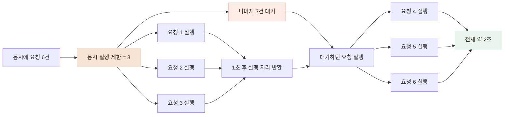

# 동시 요청 테스트로 AI 서버의 실행 제한과 타임아웃을 검증했습니다

> AI 분석 요청이 몰려도 **서버가 무제한으로 작업을 실행하거나 사용자를 끝없이 기다리게 하지 않도록**, 동시 실행 제한·타임아웃·비차단 처리가 실제 요청에서도 동작하는지 검증했습니다.

## 한눈에

| | |
|---|---|
| **위험** | 무거운 분석 요청이 동시에 들어오면 메모리 사용량과 대기 시간이 함께 늘어날 수 있었습니다. |
| **안전장치** | 분석 동시 실행 수, 전체 처리 시간, 이미지 다운로드 시간을 각각 제한했습니다. |
| **검증 방법** | 외부 AI 대신 고정 지연을 반환하는 분석기를 사용해 예상 대기 시간을 먼저 계산했습니다. |
| **결과** | 동시 실행 수에 따른 처리 시간, 대기 시간을 포함한 타임아웃, 분석 중 헬스체크 응답을 확인했습니다. |

## 요청이 몰려도 예측 가능한 방식으로 처리하도록 했습니다

AI 분석은 일반적인 조회·저장 요청보다 처리 시간이 길고 CPU·GPU와 메모리를 많이 사용할 수 있습니다. 들어온 요청을 모두 동시에 실행하면 서버 자원이 한꺼번에 소진될 수 있고, 반대로 제한 없이 대기시키면 사용자는 언제 끝날지 모른 채 기다리게 됩니다.

그래서 **처리 가능한 수만 먼저 실행하고 나머지는 대기시키되, 전체 제한 시간을 넘기면 명확하게 종료**하도록 구성했습니다. 분석이 진행되는 동안에도 헬스체크 같은 가벼운 요청은 계속 처리할 수 있도록 실행 흐름을 분리했습니다.

이 검증은 최대 처리량을 높이는 실험이 아니라, **AI 요청이 몰렸을 때 서버가 예측 가능한 방식으로 처리하고 실패하는지 확인하는 것**에 목적을 뒀습니다.

## AI 서버에서 먼저 막아야 할 네 가지 상황을 나눴습니다

AI 분석 서버는 일반 API보다 한 요청의 처리 시간이 길고, 로컬 모델을 사용하면 CPU·GPU도 함께 점유합니다. 그래서 장애가 생길 수 있는 경로와 제한 장치를 먼저 짝지었습니다.

| 발생할 수 있는 상황 | 적용한 방식 |
|---|---|
| 모델이 아직 준비되지 않음 | `/health`와 `/ready`를 나눠 준비 전에는 분석 트래픽을 받지 않습니다. |
| 분석 요청이 한꺼번에 실행됨 | 세마포어로 동시에 실행할 수 있는 분석 요청 수를 제한하고, 초과 요청은 실행 가능해질 때까지 대기시킵니다. |
| 동기 추론이 다른 요청까지 막음 | 모델 로드와 추론을 별도 실행 흐름에서 처리합니다. |
| 외부 호출이나 대기가 끝나지 않음 | 전체 60초·이미지 다운로드 10초·외부 AI 호출 30초의 상한을 둡니다. |

코드에 제한이 존재하는지만 확인하지 않고, 실제 HTTP 요청에서 대기와 종료 시점이 기대한 대로 나타나는지 측정했습니다.

## 외부 AI 대신 고정 지연을 넣었습니다

실제 AI 호출은 응답 시간이 계속 달라 동시 실행 제한 자체의 효과를 보기 어려웠습니다. 그래서 분석기를 고정 지연 mock으로 바꾸고, **항상 1초 뒤 응답하도록 설정한 다음 예상 처리 시간을 계산했습니다.**

세마포어의 동시 실행 제한이 3이면 분석할 수 있는 자리가 3개 있는 것과 같습니다. 6건이 동시에 들어오면 3건만 먼저 실행하고, 나머지 3건은 자리가 생길 때까지 대기합니다.



동시에 6건을 보낼 때 실행 제한이 1이면 약 6초, 3이면 약 2초가 걸려야 합니다. **측정 전에 예상값을 먼저 정하고**, 결과가 그 관계를 따르는지 확인했습니다.

| 조건 | 예상 | 실제 |
|---|---:|---:|
| 지연 1초 · 동시 6건 · 실행 제한 1 | 약 6초 | **6.15초** |
| 지연 1초 · 동시 6건 · 실행 제한 3 | 약 2초 | **2.09초** |


동시 실행 한도가 1일 때 6건은 **6.15초**, 3일 때는 **2.09초**가 걸렸습니다. 요청은 버려지지 않았고, **정해진 수만 실행되는 동안 나머지 요청은 실행 가능해질 때까지 대기했습니다.**

## 실행을 기다리는 시간까지 타임아웃에 포함했습니다

운영의 60초를 그대로 기다리지 않고 테스트에서 전체 제한 시간을 2초로 낮춰 같은 동작을 확인했습니다.

| 시나리오 | 결과 |
|---|---|
| 처리 지연 4초 · 전체 제한 2초 | **2.01초에 `504 INFERENCE_TIMEOUT`** |
| 동시 3건 · 처리 1.5초 · 실행 제한 1 · 전체 제한 2초 | `[200, 504, 504]` |
| 이미지 응답 지연 3초 · 다운로드 제한 1초 | **1.04초에 `502 IMAGE_FETCH_FAILED`** |

```
요청 1     바로 실행 · 1.5초          → 200
요청 2·3  앞 요청 대기 + 실행         → 전체 2초 초과 · 504
```

분석 자체는 1.5초로 제한보다 짧았지만, 뒤에서 기다린 요청은 전체 2초를 넘었습니다. 그래서 **실행을 기다리는 시간부터 최종 응답까지를 하나의 제한 시간으로 계산했습니다.**

## 분석 중에도 헬스체크가 응답하는지 비교했습니다

무거운 추론을 그대로 실행하면 **분석과 관계없는 요청까지 함께 기다릴 수 있습니다.** 이를 확인하기 위해 현재의 비차단 처리와 일부러 요청 처리를 막는 비교용 구현에서 헬스체크 응답을 측정했습니다.

| 처리 방식 | 헬스체크 응답 횟수 | p50 | p95 | 가장 느린 응답 |
|---|---:|---:|---:|---:|
| **현재 비차단 처리** | **85회** | 3ms | 5ms | 17ms |
| **의도적으로 막은 비교 구현** | **4회** | 1,474ms | 1,549ms | 1,549ms |


현재 구현에서는 분석 중에도 헬스체크의 p95가 **5ms**였지만, 의도적으로 요청 처리를 막은 비교 구현에서는 **1,549ms**까지 늘었습니다. 같은 측정 구간에서 응답 횟수도 각각 85회와 4회로 차이가 났습니다. 두 결과를 비교해 현재 구현에서는 **분석이 진행되는 동안에도 헬스체크 요청이 막히지 않고 처리되는 것을 확인했습니다.**

## 검증 범위와 남은 과제

- 이 결과는 고정 지연을 주는 mock 분석기로 측정했습니다. 실제 GPU 메모리 경합과 모델 처리량은 재현하지 못했습니다.
- 현재는 동시 실행 수만 제한하고 있어, 요청이 크게 몰리는 상황에 대비해 **대기열 길이 상한과 초과 요청을 조기에 거절하는 정책을 추가할 계획입니다.**
- 현재 세마포어는 서버 인스턴스별로 동작합니다. 따라서 인스턴스가 여러 개로 늘어나면 서비스 전체의 동시 분석 수도 함께 늘어납니다.
- 운영의 60초 타임아웃을 매번 기다리는 대신, 테스트에서는 **2초로 줄여 같은 종료 동작이 나타나는지 확인했습니다.**
