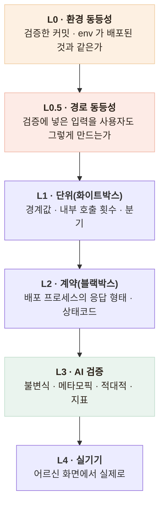

# 검증 계층 — 무엇이 무엇을 못 잡는가

> 층을 나누는 기준은 "이 층이 원리적으로 못 잡는 것"이다

## 층 구성



## 각 층이 못 잡는 것

| 결함 | 단위(L1) | 계약(L2) | AI 검증(L3) |
|---|---|---|---|
| `determine_portion(0.8)` 경계값 오판 | **잡음** | 못 잡음 (시나리오에 0.8이 없다) | 못 잡음 |
| LLM 재시도가 정확히 2회인지 | **잡음** (`GarbageLLM` 주입) | 못 잡음 (**내부 호출은 밖에서 관측 불가**) | 못 잡음 |
| 미들웨어 순서로 실서버 401 형태가 깨짐 | 못 잡음 (TestClient는 다른 경로) | **잡음** | 못 잡음 |
| uvicorn 기동 실패 (import·lifespan) | 못 잡음 (프로세스 내 실행) | **잡음** | 못 잡음 |
| 벤더가 응급에 119를 안내하지 않음 | 못 잡음 | 못 잡음 (**200이고 형태도 정상**) | **잡음** |
| 같은 뜻 다른 표현에서 필드가 달라짐 | 못 잡음 | 못 잡음 | **잡음** (메타모픽) |
| 가짜 어댑터가 운영에 나감 | 못 잡음 (**366개 통과 중이었다**) | 못 잡음 (200이다) | 못 잡음 | 
| 응급 가드가 음성 경로에서 뚫림 | 못 잡음 (**커버리지 100%였다**) | 못 잡음 | 못 잡음 |

**마지막 두 줄이 L0·L0.5를 만든 이유**다. 셋 다 초록불이었다.

## L0 — 배포된 것을 직접 찌른다

`jest` 통과는 **내 기계의 코드**가 맞다는 뜻이지 **배포된 코드**가 맞다는 뜻이 아니다.
이 프로젝트는 그 차이로 두 번 다쳤다.

```
$ npm run verify:chatbot-live

1. 상담이 시작되는가 (가짜 어댑터면 운영에서 503)     ✅
2. 응급 신호 — 배포된 가드가 고쳐진 가드인가          ✅ 4/4
3. 오탐 — 격상되면 안 되는 것                        ✅ 2/2
4. 무응답 종결 — 빈 입력 3회에 종결                   ✅
```

**입력이 음성이 아니라 문자열인 것은 의도적이다.** 이 스크립트가 묻는 것은
*"배포된 코드가 맞는 코드인가"* 하나이고, 그러려면 입력이 고정돼야 한다.
STT를 끼우면 실패했을 때 **가드가 틀린 건지 STT가 다르게 들은 건지 구분되지 않는다.**
대신 넣는 문자열이 **STT가 실제로 돌려줬던 것**이라 음성 경로의 실패 모드는 보존된다.

## L0.5 — 입력을 사용자가 만드는 방식으로 만든다

순수 함수라 테스트하기 쉬웠던 `detectEmergency()`가 **바로 그래서 위험했다.**
문자열만 넣으면 되니 **그 문자열이 어디서 오는지를 묻지 않게 된다.**

> **테스트하기 쉬운 함수가 위험할 수 있다.**
> 입력원이 사람 손이 아니라 다른 시스템(STT·OCR·파서)이면,
> 그 시스템의 출력을 통과시켜야 검증이다.

## 남은 한계

- L0.5를 계층으로 정의했지만 **다른 순수 함수들에는 적용하지 않았다.** 응급 가드에서만 밟았다
- **AI 서버 쪽에는 L0에 해당하는 배포 후 검증이 없다.** 챗봇 쪽만 스크립트가 있다
- 전 층이 **수동 실행**이다. CI에 연결돼 있지 않다
