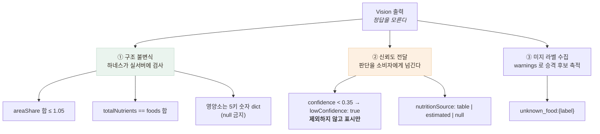

# Vision 일관성 측정 — 같은 사진 5회에 5가지 답

> 식단 분석은 정답 세트를 만들기가 훨씬 어렵습니다 — "이 비빔밥이 몇 그램인가"를 라벨링하려면
> 실제로 저울에 달아야 하고, 영양소 정답은 식약처 DB와 대조해야 합니다.
> 그래서 **정답 없이도 잴 수 있는 것**을 쟀습니다.

## 무엇을 검사했나



- **구조 불변식** — `totalNutrients == foods 합`은 정답을 몰라도 반드시 참이어야 하는 성질입니다.
  어긋나면 앱 화면에서 바로 티가 납니다
- **신뢰도 전달** — confidence가 낮다고 **서버가 잘라내지 않습니다.** 잘라 버리면 어르신이 실제로
  먹은 음식이 화면에서 사라지고 왜 없는지도 알 수 없습니다. 표시만 하고 판단은 소비자 몫
- **미지 라벨 수집** — 실패를 로그로 흘리지 않고 데이터(테이블 승격 후보)로 만듭니다

여기까지가 구조 검증이고(하네스 34/34), **일관성을 실제로 재 본 것**이 아래입니다.

## 사진 두 장을 쓴 이유

| | |
|---|---|
|  |  |
| **돌솥비빔밥** — 단일 음식 | **한정식 상차림** — 반찬 다수 |

처음엔 비빔밥 한 장으로만 쟀는데 **변동계수(CV)가 전부 0.0%로 나왔습니다.** 완벽해 보였지만
검사가 성립하지 않은 것 — 면적을 합이 1이 되도록 정규화하므로 음식이 하나면 항상 1.000이고
분산이 0입니다. **흔들림은 "몇 개로 쪼갤 것인가"에서 나오므로** 반찬이 여럿인 상차림을 추가했습니다.

## 결과 — 같은 사진 5회

| | 돌솥비빔밥 (단일) | 한정식 상차림 (반찬 다수) |
|---|---|---|
| 서로 다른 결과 | 1종 | **5종 — 5회 모두 다름** |
| 라벨 Jaccard 평균 | 100% | **27.0%** |
| 음식 개수 | 1 | 6~7 |

```
5회 결과가 전부 달랐다
  grilled_fish, kimchi, noodle_side_dish,   rice,         soup,  vegetable_side_dish
  grilled_fish, kimchi, mixed_vegetables,   noodles,      soup,  tofu_stew
  grilled_fish, kimchi, mixed_vegetables,   pickled_vegetables,  rice, seaweed_salad, stews
  grilled_fish, kimchi, pancake,            soup,  steamed_rice, stir-fried_vegetables
  grilled_fish, kimchi, seasoned_vegetables, stew, steamed_rice, sweet_potato_noodle
```

화면에 뜨는 총 영양소가 이만큼 흔들립니다.

| 항목 | 최소 | 최대 | CV |
|---|---|---|---|
| calories | 822.5 | 1042.0 | 10.6% |
| carbsG | 54.2 | 136.8 | 29.9% |
| **sodiumMg** | **1452.5** | **2942.5** | **22.2%** |

**나트륨이 2배 차이로 나옵니다.** 고혈압 어르신에게 나트륨은 핵심 지표인데, 같은 사진을 두 번
찍으면 다른 판정이 나올 수 있다는 뜻입니다. portion 판정도 실제로 뒤집혔습니다
(grilled_fish가 large/regular) — 배율이 0.65/1.0/1.35로 갈리므로 한 칸 움직이면
그 음식의 영양소가 2배 차이납니다.

**메타모픽(의미 보존 변환)도 함께 쟀습니다.**

| 변환 | Jaccard | kcal 차이 |
|---|---|---|
| JPEG 재인코딩 (q=75) | 33% | +54% |
| **좌우 반전** | **15%** | +38% |
| 밝기 +15% | 75% | +22% |

**좌우로 뒤집었을 뿐인데 거의 다른 상차림으로 봅니다.** 압축 품질만 낮춰도 칼로리가 54% 뜁니다.

## 원인 — 라벨 공간이 자유롭다

```
rice / steamed_rice
soup / stew / stews / tofu_stew
vegetable_side_dish / seasoned_vegetables / stir-fried_vegetables / mixed_vegetables
```

**인식이 틀린 게 아니라 이름과 입도(granularity)가 매번 다릅니다.** 그리고 그 라벨이 곧
영양 테이블 조회 키라, 라벨이 흔들리면 `table`/`estimated`/`null`이 갈리고 총합이 흔들립니다.
이 발견이 라벨 안정화 작업(트러블슈팅 · 라벨 문서)으로 이어졌습니다.

부수 발견 — 상차림은 느립니다. 비빔밥 p50 2.1초 vs **상차림 p50 8.7초, 최악 12.7초.**
토큰은 고정해도 출력이 길어지면(음식 6~7개) 생성 시간이 늘어납니다.
어르신이 결과 화면에서 12초를 기다리는 것은 깁니다.

## 이 측정이 남긴 것

- "잴 수 있는 게 없다"에서 **"일관성은 쟀고 정확도가 남았다"** 로 좁혔습니다
- 정확도보다 먼저 고쳐야 할 문제(라벨 흔들림)가 드러났고, 다음 작업 —
  라벨 어휘 고정 · N회 다수결 검토 · 화면에 불확실성 표시 — 를 측정이 정해 줬습니다
- 한계도 남깁니다 — **일관성 ≠ 정확도.** 5번 다 똑같이 틀릴 수도 있습니다.
  CV 22%짜리 값을 소수점까지 보여 주는 지금 화면은 과신을 부릅니다
